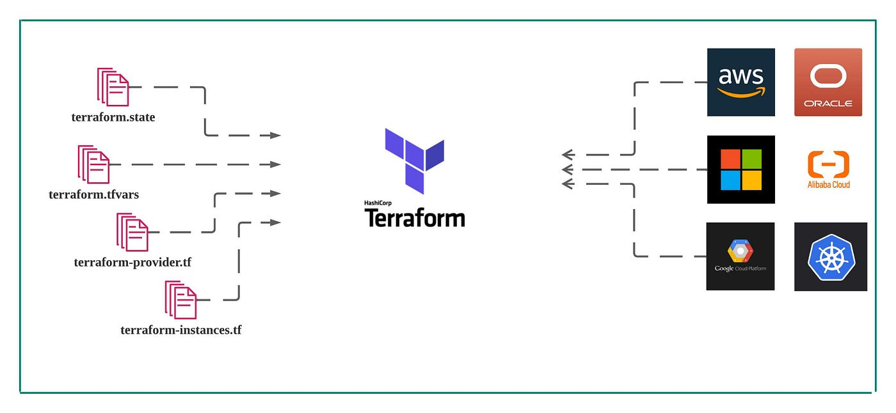
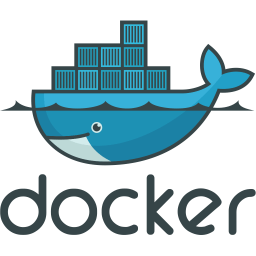

# Terraform Single File Docker Task 

This task requires to create terraform project file that will start multi container environment with nginx as loadbalancer 
and ssl configuration to be implemented.

- Create 2 contatiners:
    - nginx with https to forward to other container
    - app container to answer with `hello world` back to the requester

- Create terraform file `main.tf`:
    - run above mentioned containers
    - verify that there is dns redirection with /etc/hosts to some fake dns name (use your imagination)
    - print out the ip address of nginx container

 

## Table Of Contents

- [Prerequisites](#prerequisites)
- [DirectoryStructure](#directorystructure) 
- [Breakdown](#breakdown)
- [Script](#script)
- [Installation](#installation)
- [Contributing](#contributing)

## Prerequisites

- Linux Debian distribution
- Python 3.5 or later (python ≥ 3.6 is recommended) and pip are installed
- Docker environment installed (docker-compose)
- Terraform environment installed
- Ensure firewall allows outbound traffic to necessary endpoints 

## Directory Structure

terraform-nginx-loadbalancer/
|
── main.tf
|
── nginx.conf
|
── Dockerfile

## Breakdown 

- Nginx Container: The Nginx container will act as a reverse proxy with SSL configured. It will forward requests to the app container.
- App Container: The app container will run a simple web server that responds with "Hello World."
- DNS Redirection: I'll use /etc/hosts to create a aragorn.local DNS name.
- Terraform Configuration: The main.tf file will be used to configure the Docker containers, setup DNS redirection, and print the IP address of the Nginx container.

## Installation

- ./setup.sh
- ./ssl.sh 

### Execution steps: 

- ''' sudo apt update '''
- ''' sudo apt-get upgrade '''
- ''' sudo apt install python3-pip '''
- ''' sudo mkdir tasks\terraform '''
- ''' cd tasks\terraform '''
- ''' sudo git init '''
- ''' sudo git clone https://github.com/ethan-yadan/Terraform_Single_Task.git '''
- ''' ./setup.sh '''
- ''' ./ssl.sh '''
- ''' terraform init '''
- ''' terraform fmt main.tf '''
- ''' terraform apply '''

- Open a browser and go to https://aragorn.local:8443. You should see the "Hello World" response from the app container.

## Contributing 
Gigantum humeris insidentes
